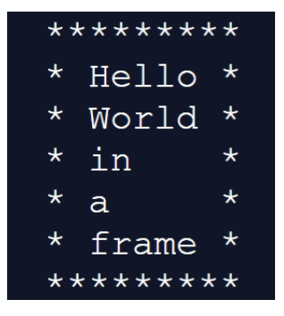

# Instructions

1. Prompt the user for several words (separated by commas).
2. Put the words into an array.
3. Console.log the words one per line, in a rectangular frame as seen below.
4. Check out the Hints and Requirements below.

For example, if the user gives you:
`Hello, World, in, a, frame`
you will transform it to : `["Hello", "World", "in", "a", "frame"]`
that will get displayed as:

# Hint

* The number of stars that wraps the sentence, must depend on the length of the longest word.

# Requirements

* To do this challenge you only need Javascript(No HTML and no CSS)